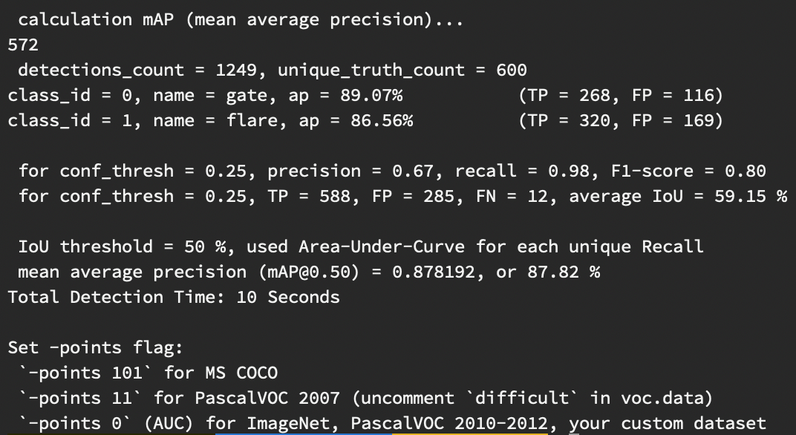

# Zeabus Darknet-YoloV3 Implementation

- This is the implementation of Darknet-YoloV3 aiming for using with Deepstream and Jetson TX2 in the UAV for Robosub 2020 and SAUVC 2020.  
-  Its function is to detect and classifiy the objective gates and flares underwater.

Released: May 12, 2020  
Darknet-Yolo main repository: https://github.com/AlexeyAB/darknet  
For those who wants to really know how Yolo works: https://www.youtube.com/playlist?list=PL_IHmaMAvkVxdDOBRg2CbcJBq9SY7ZUvs  

## Data Preparation For Yolo
- A trainning dataset can be preapared by the instruction in the refernece link. In the `data-prep/`, you can find scripts for creating `train/test .txt`.  
- Also, there is a script for converting data format `conversion.py` from `(x,y,w,h)` to Yolo format `(x,y,center_x,center_y)`.
- In `data/` you will find the example of created files preapared for Darknet-YoloV3 from the data in `Original/images/`.

## Data Augmentation
- If a raw trainning dataset is not enough, you can augmenting the current trainning set with the script in `augmentation-tool/` by running `augmentation.py -p image_path -f labeled_data_value.csv`. **.csv file must be placed inside the image_path directory**

- In line 98 `number_of_augment =` specify the number of the output augmented data. For example, if set to 2 then the amount of augmented data will be twice of the original data.  
- The augmanetaion functions is randomly defined (see `augmentation()` line 49). The ratio for the random function can be specify with the variable `rand1` (line 50).

## My Experiment
Pre-trained and trained weights: https://drive.google.com/open?id=166IY8LMWHVotWFCKsrmypBZWbTkO_bgp  
Images: https://drive.google.com/open?id=1xpTKdKHnl9kTGnbRX5_xeaYhehgFnQDb  

- My example experiment is include in the `experiment/`. The weights and images from this experiment is in the linka above. 

- The first experiment was train with only the original datas. The result could not be tested as all the datas were used up in the trainning process. 

- In the the second experiment, the model was trained with the augmented datas + original datas. The augmented datas was randomly grouped into 80/20 for traning and testing.  
- The datas was augment with the scripts provided. The configuration is `number_of_augment = 2` and `rand1  = random.randint(0, 7)`.  
- This brings a total of 2397 (augmented) + 1499 (orignal) trainning set and 572(augmented) testing set.  
- Both experiment were trainning with the `darknet53.conv.74` pre-trained weight.

- The result after trainning for 9000 iterations (the best result) is show below.

